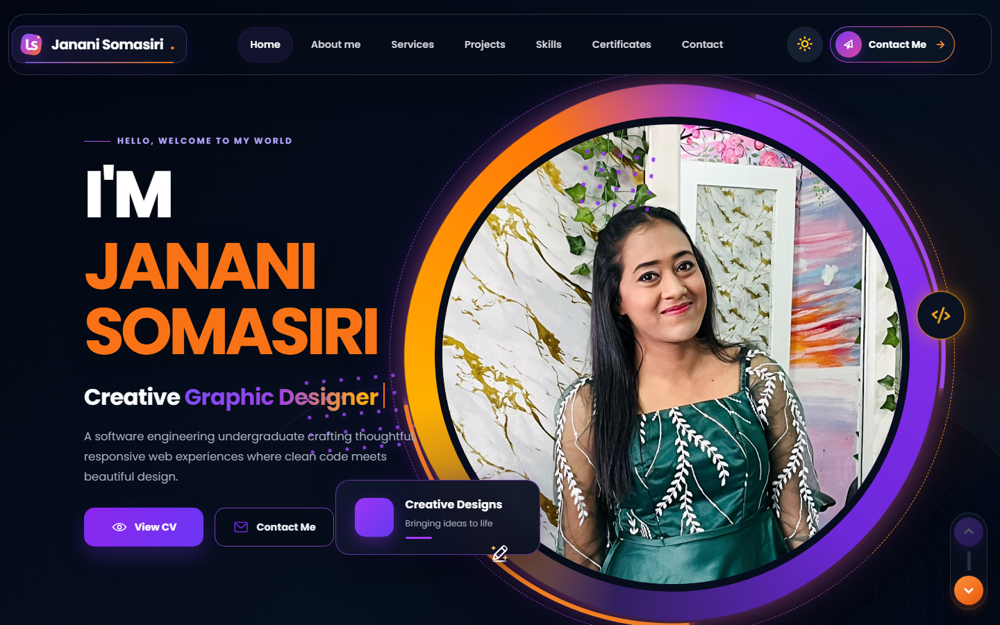
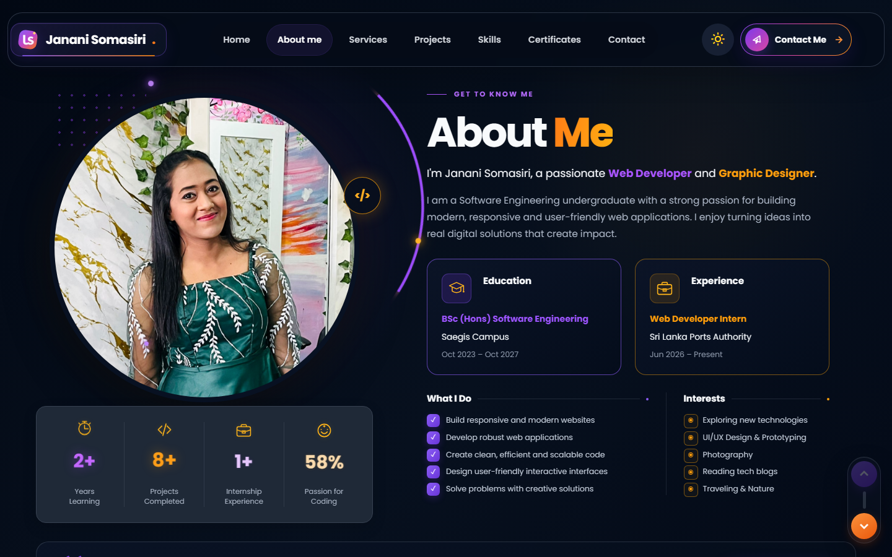
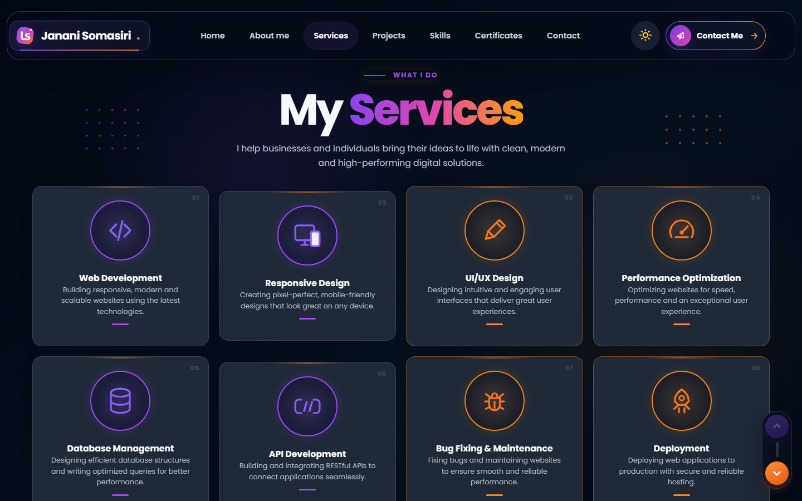
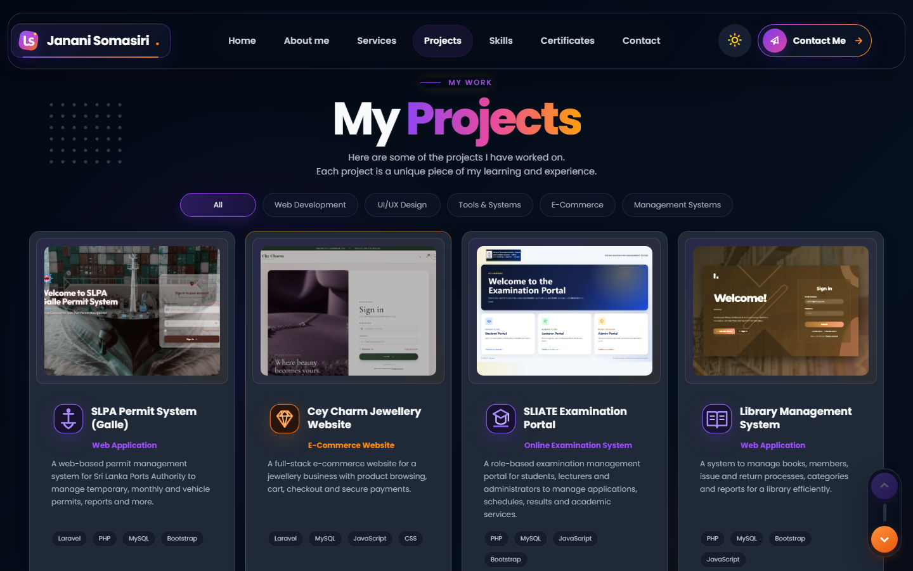
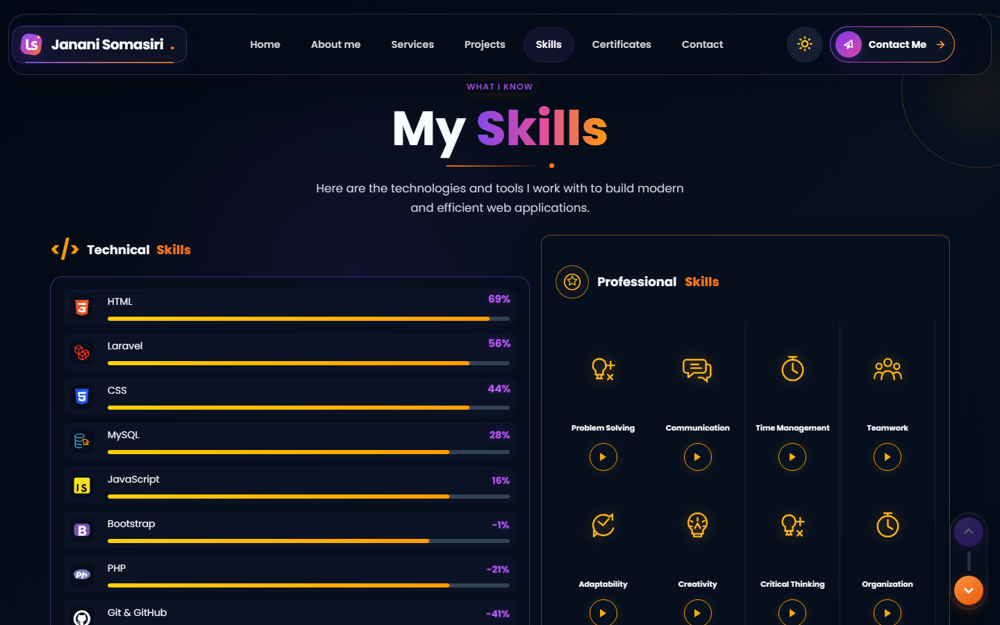
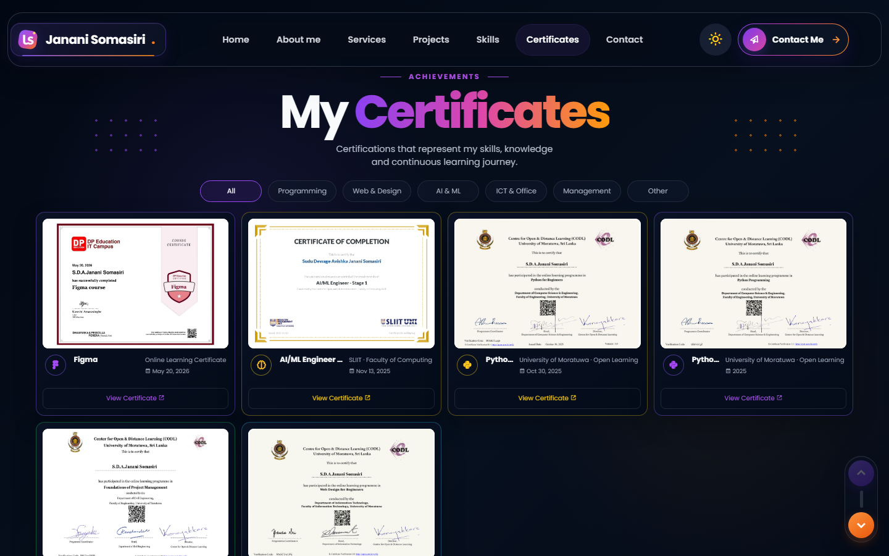
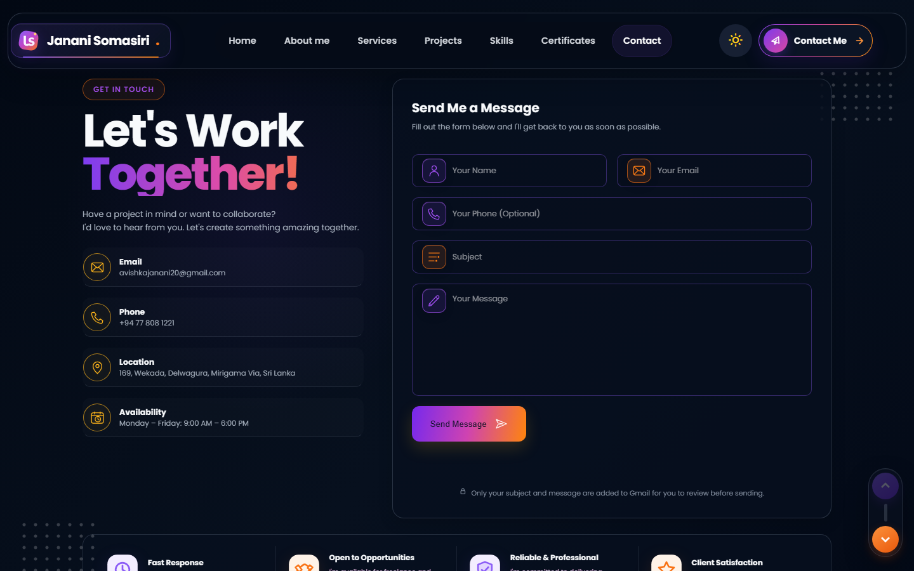

<div align="center">
  

  # Janani Somasiri

  ### Software Engineering Undergraduate · Web Developer · Creative Designer

  A modern and responsive portfolio where clean code meets creative design.

  [](https://github.com/janani-create/janani-portfolio)
  [](certificates.html)
  [](https://github.com/janani-create)

  <br>

  
  
  
  
</div>

---

## ✨ About This Portfolio

This portfolio presents my software engineering journey, selected projects, technical and professional skills, services, and learning achievements through an engaging and accessible interface.

The design combines a deep modern theme with purple and orange accents, animated portrait effects, smooth reveals, and carefully crafted responsive layouts.

<p align="center">
  <a href="#portfolio-preview">Preview</a> ·
  <a href="#highlights">Highlights</a> ·
  <a href="#technologies">Technologies</a> ·
  <a href="#run-locally">Run Locally</a> ·
  <a href="#project-structure">Structure</a>
</p>

<a id="portfolio-preview"></a>

## 🖼️ Portfolio Preview

### Home

<p align="center">
  
</p>

<table>
  <tr>
    <td width="50%" align="center"><strong>About Me</strong></td>
    <td width="50%" align="center"><strong>Services</strong></td>
  </tr>
  <tr>
    <td></td>
    <td></td>
  </tr>
  <tr>
    <td width="50%" align="center"><strong>Projects</strong></td>
    <td width="50%" align="center"><strong>Skills</strong></td>
  </tr>
  <tr>
    <td></td>
    <td></td>
  </tr>
  <tr>
    <td width="50%" align="center"><strong>Certificates</strong></td>
    <td width="50%" align="center"><strong>Contact</strong></td>
  </tr>
  <tr>
    <td></td>
    <td></td>
  </tr>
</table>

<a id="highlights"></a>

## 🌟 Highlights

| Experience | Portfolio Content | Accessibility |
| --- | --- | --- |
| 🌗 Dark and light themes | 💼 Filterable project gallery | ⌨️ Keyboard-friendly controls |
| ✨ Page-opening drape animation | 🏆 Interactive certificates | 🧘 Reduced-motion support |
| 🌊 Animated portrait effects | 📄 Built-in PDF viewer | 📱 Mobile-first responsiveness |
| 🧭 Smooth section navigation | 🛠️ Skills and services showcase | 🏷️ Clear accessible labels |
| ✉️ Gmail Compose contact flow | 🎬 Branded click transitions | 🔒 Review before sending |

<a id="technologies"></a>

## 🛠️ Technologies

| Category | Tools |
| --- | --- |
| Structure | HTML5 |
| Styling | CSS3, responsive layouts, custom animations |
| Interactivity | Vanilla JavaScript |
| Components | Swiper, Boxicons |
| Workflow | Git, GitHub, VS Code, XAMPP |

## 📂 Featured Sections

- **Home** — introduction, role, calls to action, and animated portrait
- **About** — background, education, interests, and experience
- **Services** — development and design capabilities
- **Projects** — selected work with category filtering
- **Skills** — technical tools and professional strengths
- **Certificates** — filterable achievements with image and PDF previews
- **Contact** — contact form and availability details

<a id="run-locally"></a>

## 🚀 Run Locally

No build process or package installation is required.

1. Clone the repository:

   ```bash
   git clone https://github.com/janani-create/janani-portfolio.git
   ```

2. Open the project folder:

   ```bash
   cd janani-portfolio
   ```

3. Open `index.html` directly in your browser.

Alternatively, place the project inside XAMPP's `htdocs` directory and visit:

```text
http://localhost/janani-portfolio/
```

<a id="project-structure"></a>

## 🗂️ Project Structure

```text
janani-portfolio/
├── index.html                 # Main portfolio page
├── certificates.html          # Complete certificate gallery
├── certificate-viewer.html    # Certificate PDF viewer
├── style.css                  # Layout, themes, and animations
├── script.js                  # Interactions and filtering
├── images/                    # Branding, icons, and previews
└── documents/                 # CV and certificate PDFs
```

## 🔒 Privacy

Private social-media links and authentication details are intentionally excluded from this public repository. The contact form opens Gmail Compose and passes only the subject and message entered by the visitor; Gmail always allows review before sending.

## 👩‍💻 Author

<div align="center">
  

  <strong>Janani Somasiri</strong><br>
  Software Engineering Undergraduate & Web Developer

  _Designing meaningful experiences and building them with code._
</div>

## 📜 Usage

This is a personal portfolio project. The design, personal images, CV, and certificate documents remain the property of Janani Somasiri and may not be reused without permission.

---

<div align="center">
  Made with 💜, creativity, and code.
</div>
